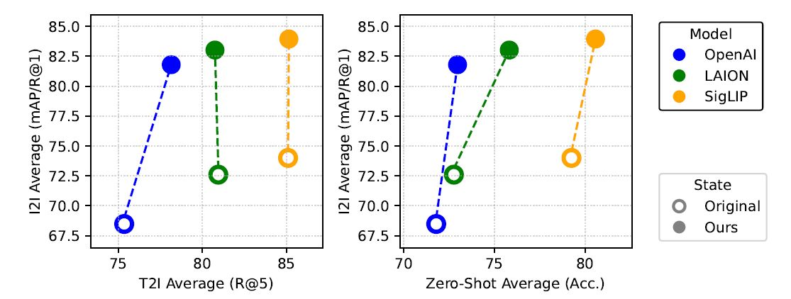
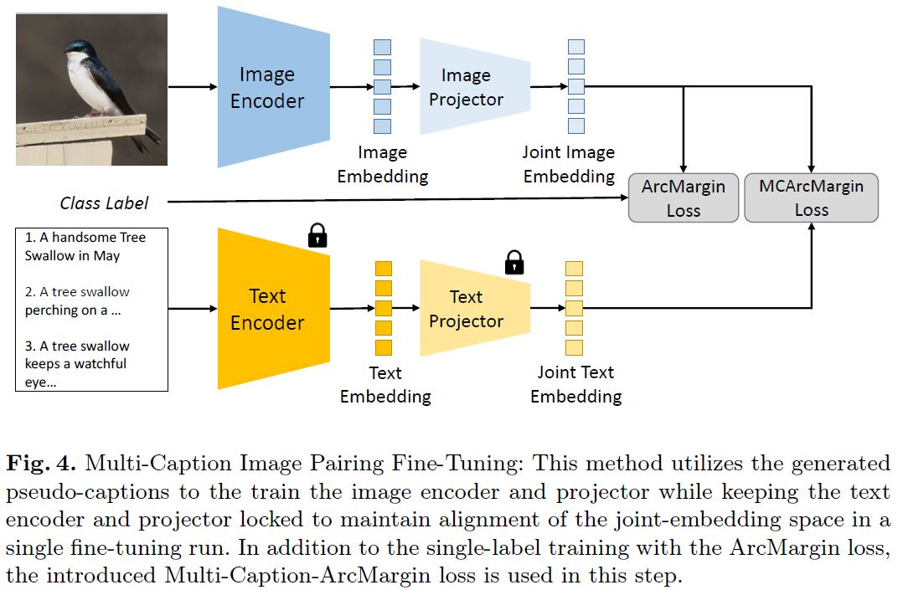
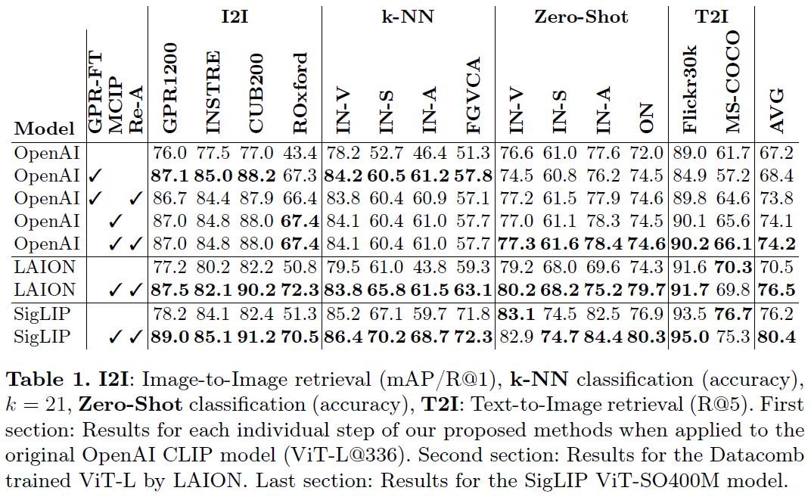

# Retrieval Optimized CLIP Models

**Optimizing CLIP Models for Image Retrieval with Maintained Joint-Embedding Alignment** ([ArXiv](https://arxiv.org/abs/2111.13122))

**Konstantin Schall, Kai Uwe Barthel, Nico Hezel, Klaus Jung**

[Visual Computing Group HTW Berlin](https://visual-computing.com/)

</img>

### Abstract:
Contrastive Language and Image Pairing (CLIP), a transformative method in multimedia retrieval, typically trains two neural networks concurrently to generate joint embeddings for text and image pairs. However, when applied directly, these models often struggle to differentiate between visually distinct images that have similar captions, resulting in suboptimal performance for image-based similarity searches. This paper addresses the challenge of optimizing CLIP models for various image-based similarity search scenarios, while maintaining their effectiveness in text-based search tasks such as text-to-image retrieval and zero-shot classification. We propose and evaluate two novel methods aimed at refining the retrieval capabilities of CLIP without compromising the alignment between text and image embeddings. The first method involves a sequential fine-tuning process: initially optimizing the image encoder for more precise image retrieval and subsequently realigning the text encoder to these optimized image embeddings. The second approach integrates pseudo-captions during the retrieval-optimization phase to foster direct alignment within the embedding space. Through comprehensive experiments, we demonstrate that these methods enhance CLIP's performance on various benchmarks, including image retrieval, k-NN classification, and zero-shot text-based classification, while maintaining robustness in text-to-image retrieval. Our optimized models permit maintaining a single embedding per image, significantly simplifying the infrastructure needed for large-scale multi-modal similarity search systems.

### Method:
We propose two methods that significantly improve pre-trained CLIP models for image-to-image retrieval, while preserving the joint-embedding alignment and text-based task qualities.

The second method, Multi-Caption-Image-Pairing (MCIP), leads to the best results across all models:

</img>

### Results:
</img>

## Model Checkpoints:

| open_clip Name    | open_clip pretrained | Optimized Checkpoint |
|-------------------|----------------------|----------------------|
| ViT-L-14-336      |       openai         | [checkpoint](https://visual-computing.com/files/MCIP/MCIP-ViT-L-14-336.pth)  |
| ViT-SO400M-14-SigLIP-384 |webli          | [checkpoint](https://visual-computing.com/files/MCIP/MCIP-ViT-SO400M-14-SigLIP-384.pth)       |

# Using our models

If you want to try out models, you simply have to install [open_clip](https://github.com/mlfoundations/open_clip), download one of the above checkpoints, create the respective open_clip model instance and load our weights. That's it! 

```python
import open_clip

model, _, transform = open_clip.create_model_and_transforms("ViT-SO400M-14-SigLIP-384", pretrained="webli")

checkpoint_path = '/path/to/checkpoint.pth'
mcip_state_dict = torch.load(checkpoint_path)
model.load_state_dict(mcip_state_dict, strict=True)
```

# Train your own models

This repository now contains code for each of the fine-tuning methods mentioned in the paper!

## Installation
Create a new Python environment and install the required packages:

```bash
pip install -r requirements.txt
```

## Prepare the data
We used a combination of five publicly available training sets for the general-purpose retrieval and MCIP fine-tuning:

1. ImageNet21k (Classes from ImageNet1k were excluded). [Download instructions](https://github.com/Alibaba-MIIL/ImageNet21K/blob/main/dataset_preprocessing/processing_instructions.md)
2. Google Landmarks v2 [Download instructions](https://github.com/cvdfoundation/google-landmark)
3. Alibaba Products [Download instructions](https://tianchi.aliyun.com/competition/entrance/231780/information)
4. iNat 2021 [Download instructions](https://github.com/visipedia/inat_comp/tree/master/2021)
5. VGG Face2 [Download instructions](https://github.com/ox-vgg/vgg_face2)

However, you can use any combination of data you like. 
Preprocess your training dataset and store it in two numpy files.
One should contain all paths to images that you want to use.
The second should contain the unique category identifiers for each of the categories in the training data for each image. These files should have the same order as the first file.
The identifiers can be integers or strings, but should not overlap between the dataset parts.

Adjust the [config file](MCIP/src/gpr-ft/config/SigLIP400_MCIP_AdamW_384.yaml) of your experiment and set the parameters:

```yaml
data: 
  image_paths: /mnt/data/features/GPR_Full_paths.npy
  image_categories: /mnt/data/features/GPR_Full_cats.npy
```

## Download the GPR1200 evaluation set
This set will track the progress of the general-purpose retrieval fine-tuning.
Download the images under this [link](https://visual-computing.com/files/GPR1200/GPR1200.zip) and extract the zip file.
Adjust the config parameter:

```yaml
data: 
  eval_base_path: /path/to/evaluation_base_folder/
```

## Download the CC12M data
This set is currently used to generate MCIP pseudo-captions and for realignment fine-tuning. However, any text-image pairs collection should also work.
Follow the [img2dataset example](https://github.com/rom1504/img2dataset/blob/main/examples/cc12m.md) to obtain a sharded version of this dataset.

## GPR-Fine-Tuning without MCIP
This step will only train the image-encoder with the pre-processed data. The text-encoder will have to be realigned in an additional step.
Run the following command to start fine-tuning:

```bash
python gpr-ft/main.py --mode train --cfg gpr-ft/config/GPR_SigLIP400_ArcFaceText_AdamW_384.yaml --gpu_id 0
```

The model weights will be saved in the logs folder under the name corresponding to the config file.

## GPR-Fine-Tuning with MCIP

First, we need to create the pseudo-captions.

Set the parameter:

```yaml
data:
    train_image_embeddings_file_path: ""
```

Extract the image embeddings of the GPR fine-tuning dataset:

```bash
python gpr-ft/main.py --mode extract_image_features --cfg gpr-ft/config/SigLIP400_MCIP_AdamW_384.yaml --gpu_id 0
```

Extract the text values and embeddings of the realignment dataset:

```bash
export CUDA_VISIBLE_DEVICES=0,1
torchrun --nproc_per_node 2 -m realignment.main \
    --train-data '/path/to/CC12M/cc12m/{00000..01242}.tar' \
    --train-num-samples 10968539 \
    --dataset-type webdataset \
    --batch-size 16384 \
    --precision amp \
    --workers 16 \
    --model ViT-SO400M-14-SigLIP-384 \
    --pretrained webli \
    --extract-text-features-only \
    --store_features_path features/
```

The text value and embedding files will be saved to the specified folder. 

Set the paths of the newly generated files in the config file parameters and the desired similarity threshold:

```yaml
data:
    train_image_embeddings_file_path: "features/GPR_Train_OClipL_imagefeatures.npy"
    caption_value_files: "features/12CCM_OClipL_text_0.npy;features/12CCM_OClipL_text_1.npy"
    caption_embeddings_files: "features/12CCM_OClipL_textfeatures_0.pth;features/12CCM_OClipL_textfeatures_1.pth"
    caption_output_dir: captions
MCIP:
    sim_th: 0.27
```

Generate pseudo-captions:

```bash
python gpr-ft/main.py --mode create_pseudo_captions --cfg gpr-ft/config/GPR_SigLIP400_TextArcFaceText_AdamW_384.yaml --gpu_id 0
```

Run the MCIP fine-tuning script:

```bash
python gpr-ft/main.py --mode train_with_text --cfg gpr-ft/config/SigLIP400_MCIP_AdamW_384.yaml --gpu_id 0
```

## Realignment Fine-Tuning

Both methods benefit from a realignment fine-tuning, and it is necessary to restore the multi-modal capabilities in case you fine-tuned your model without MCIP.

Since the improved image-encoder should not be changed anymore, the image embeddings can be extracted once before the realignment fine-tuning begins:

```bash
export CUDA_VISIBLE_DEVICES=0,1
torchrun --nproc_per_node 2 -m realignment.main \
    --train-data '/path/to/images/CC12M/cc12m/{00000..01242}.tar' \
    --train-num-samples 10968539 \
    --dataset-type webdataset \
    --batch-size 512 \
    --precision amp \
    --workers 16 \
    --model ViT-SO400M-14-SigLIP-384 \
    --GPR-model-weights '../logs/gpr-ft/exp_name/GPR1200.pth' \
    --pretrained webli \
    --force-image-size 384 \
    --image-mean 0.5 0.5 0.5 \
    --image-std 0.5 0.5 0.5 \
    --extract-features-only 
```

Start the realignment fine-tuning with the extracted embeddings:

```bash
export CUDA_VISIBLE_DEVICES=0,1
torchrun --nproc_per_node 2 -m realignment.main \
    --train-data '/mnt/bigdata/images/CC12M/cc12m/{00000..01242}.tar' \
    --train-num-samples 10968539 \
    --dataset-type webdataset \
    --batch-size 16384 \
    --precision amp \
    --workers 16 \
    --imagenet-val /mnt/data/images/ImageNet1k_2012/val \
    --model ViT-SO400M-14-SigLIP-384 \
    --pretrained webli \
    --grad-checkpointing \
    --lock-image \
    --lock-image-unlocked-groups 0  \
    --lock-image-freeze-bn-stats \
    --force-image-size 384 \
    --dataset-resampled \
    --lr 0.00001 \
    --lock-text  \
    --lock-text-unlocked-layers 16   \
    --delete-previous-checkpoint \
    --train-with-features-only \
    --log-every-n-steps 5 \
    --image-embedding-files /mnt/bigdata/features/12CCM_S400_imagefeatures_0.pth /mnt/bigdata/features/12CCM_S400_imagefeatures_1.pth \
    --image-key-files /mnt/bigdata/features/12CCM_S400_keys_0.npy /mnt/bigdata/features/12CCM_S400_keys_1.npy \
    --image-embedding-dim 1152
```

Your model now has improved image-to-image nearest-neighbor search capabilities and performs equally well or better in textual zero-shot classification and text-to-image retrieval!

## Acknowledgements
 The realignment fine-tuning code base is heavily based on [open clip](https://github.com/mlfoundations/open_clip). Thanks to all contributors of this awesome libary!