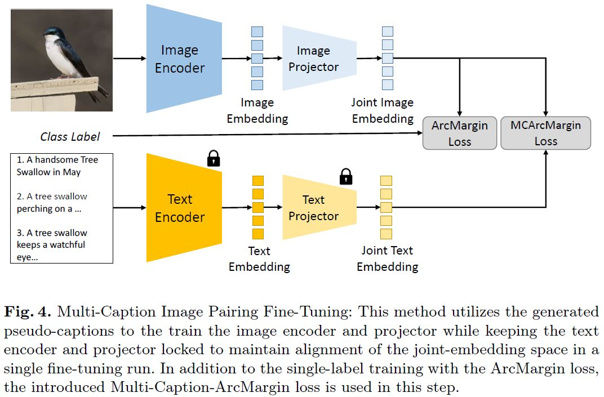

# Retrieval Optimmized CLIP Models

**Optimizing CLIP Models for Image Retrieval with Maintained Joint-Embedding Alignment** ([ArXiv](https://arxiv.org/abs/2111.13122))

**Konstantin Schall, Kai Uwe Barthel, Nico Hezel, Klaus Jung**

[Visual Computing Group HTW Berlin](https://visual-computing.com/)


</img>


Contrastive Language and Image Pairing (CLIP), a transformative method in multimedia retrieval, typically trains two neural networks concurrently to generate joint embeddings for text and image pairs. However, when applied directly, these models often struggle to differentiate between visually distinct images that have similar captions, resulting in suboptimal performance for image-based similarity searches. This paper addresses the challenge of optimizing CLIP models for various image-based similarity search scenarios, while maintaining their effectiveness in text-based search tasks such as text-to-image retrieval and zero-shot classification. We propose and evaluate two novel methods aimed at refining the retrieval capabilities of CLIP without compromising the alignment between text and image embeddings. The first method involves a sequential fine-tuning process: initially optimizing the image encoder for more precise image retrieval and subsequently realigning the text encoder to these optimized image embeddings. The second approach integrates pseudo-captions during the retrieval-optimization phase to foster direct alignment within the embedding space. Through comprehensive experiments, we demonstrate that these methods enhance CLIP's performance on various benchmarks, including image retrieval, k-NN classification, and zero-shot text-based classification, while maintaining robustness in text-to-image retrieval. Our optimized models permit maintaining a single embedding per image, significantly simplifying the infrastructure needed for large-scale multi-modal similarity search systems.

### Method:
We propose two methods that significantly improve pre-trained CLIP models for image-to-image retrieval, while preserving the joint-embedding alignement and text-based task qualities.

The second methods, Multi-Caption-Image-Pairing (MCIP) leads to the best results across all models:

</img>

### Results:
</img>

## Model Checkpoints:

| open_clip Name    | open_clip pretrained | Optimized Checkpoint |
|-------------------|----------------------|----------------------|
| ViT-SO400M-14-SigLIP-384 |webli          | comming soon...      |

# Using our models

All models are [open_clip](https://github.com/mlfoundations/open_clip) CLIP-model instances and inherit all of the original functionalities. To use our optimized models, simply download the above checkpoints, create the respective open_clip model instance and load our weights. Thats it! 

```python
import open_clip

model, _, transform = open_clip.create_model_and_transforms("ViT-SO400M-14-SigLIP-384", pretrained="webli")

mcip_state_dict = torch.load(checkpoint_path)["state_dict"]
model.load_state_dict(mcip_state_dict, strict=True)
```

<!--

[checkpoint](https://visual-computing.com/files/MCIP/MCIP-ViT-SO400M-14-SigLIP-384.pt) 

An example on how to use our finetuned models for inference is shown in this [notebook](./notebooks/General-Purpose-Embedding%20ViT.ipynb). Download the checkpoints and follow the Setup above, then open the "ipynb" file in the "notebook" directory using the Jupyter Notebook webseite. Edit the code in the notebook and run the code cells.

Images are not devided into query and index sets for evaluation and the full mean average precision value is used as the metric. Instructions and evalution code can be found in this repository.

[This notebook](eval/eval_notebook.ipynb) contains evaluation code for several models with Pytorch and the awesome [timm](https://github.com/rwightman/pytorch-image-models) library.

If you have precomputed embeddings for the dataset, you can run the eval script with the following command:

```bash
python ./eval/evaluate.py --evalfile-path '/path/to/embeddings' \
                            --mode 'embeddings' \
                            --dataset-path '/path/to/GPR1200/images'
```

In this case an evaluation file has to be provided that contains embeddings in the order created by the GPR1200 dataset object. This can be a npy file or a pickable python list.

```python
GPR1200_dataset = GPR1200('/path/to/GPR1200/images')
```

If you work with local features, it is best to provide nearest neighbours indices. For this case run the evaluation script in the indices mode:

```bash
python ./eval/evaluate.py --evalfile-path='/path/to/indices' \
                            --mode='indices' \
                            --dataset-path='/path/to/GPR1200/images'
```

## Reference

Reference to cite when you use the GPR1200 dataset in a research paper:
```
@inproceedings{GPR1200,
    author = {Schall, Konstantin and Barthel, Kai Uwe and Hezel, Nico and Jung, Klaus},
    title = {GPR1200: A Benchmark for General-Purpose Content-Based Image Retrieval},
    year = {2022},
    isbn = {978-3-030-98357-4},
    publisher = {Springer-Verlag},
    address = {Berlin, Heidelberg},
    url = {https://doi.org/10.1007/978-3-030-98358-1_17},
    doi = {10.1007/978-3-030-98358-1_17},
    booktitle = {MultiMedia Modeling: 28th International Conference, MMM 2022, Phu Quoc, Vietnam, June 6–10, 2022, Proceedings, Part I},
    pages = {205–216},
    numpages = {12},
    location = {Phu Quoc, Vietnam}
}
``` -->